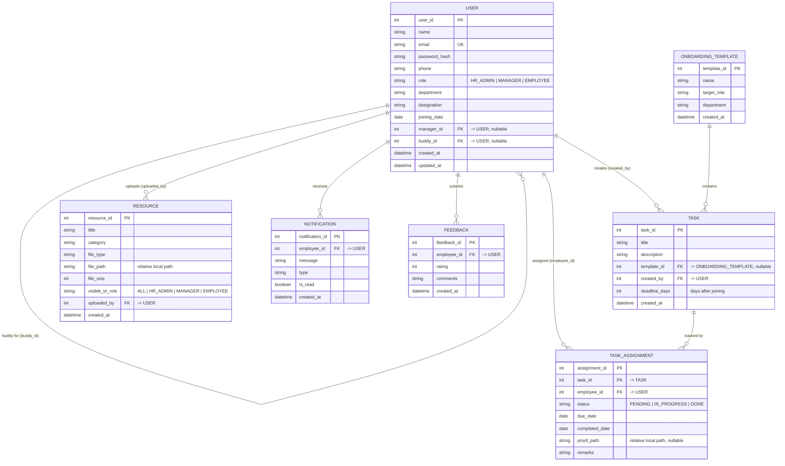

# Review — Digital Onboarding Buddy Tool (July 01)

Mentor review of `Digital_Onboarding_Buddy_Tool_Project_Document_v1.docx`.
Covers the functional spec, the ER diagram / data model, the proposed tech stack, and
recommended library additions. Feature suggestions are included at the end.

> **Scope assumption for this review:** the project is **locally hosted** for now — no
> production hosting, and **resource files are stored on the local filesystem** (not cloud
> storage). Recommendations are scoped accordingly.

---

## 1. Overall assessment

A solid, well-scoped student project with a clear problem statement and a sensible feature
list. The team understands the domain (roles, tasks, resources, progress). The two things
to fix now, before code exists, are:

- **Under-specification** — lots of *what*, very little *how* or *how well* (no non-functional requirements)
- **A relational data model paired with a document database** — the ER diagram and MongoDB pull in opposite directions

---

## 2. Data model (ER diagram) — most important fixes

### 2.1 Collapse the three person tables into one

`HR/ADMIN`, `MANAGER`, and `EMPLOYEE` all carry the same columns (Name, Email, Password,
Phone, Role). This causes real problems:

- **Login is ambiguous** — which table do you check when someone signs in? You'd query all three
- **`TASK.Assigned_By` and `EMPLOYEE.Manager_ID` can't cleanly reference "a person"** — a foreign key points to one table, but the assigner could be HR *or* a manager, and a manager is also an employee
- **Duplication** — the same human (a manager) exists as both a MANAGER row and, conceptually, an employee

**Fix:** one `User` table with a `role` field (`HR_ADMIN | MANAGER | EMPLOYEE`). The
manager relationship becomes a self-referencing `manager_id` on that table. This one change
simplifies auth, RBAC, and every foreign key.

```
User
  user_id (PK)
  name, email (unique), password_hash, phone
  role            -- HR_ADMIN | MANAGER | EMPLOYEE
  department, designation, joining_date
  manager_id (FK -> User.user_id, nullable)   -- self reference
  created_at, updated_at
```

### 2.2 Don't maintain CONTACT as a separate people table

"Important contacts (HR, Manager, IT Support)" are mostly already `User` rows. A separate,
manually maintained contact table will drift out of sync. Derive contacts from users (e.g.
a flag or a directory view), and keep a dedicated table only for **external / non-user**
contacts if you truly need one.

### 2.3 One source of truth for task completion

`PROGRESS.Status` and `TASK.Status` both track status. Decide who owns what:

- `TASK` owns the **definition** (title, description, deadline)
- `TaskAssignment` / `PROGRESS` owns **per-employee completion** (status, completed_date, remarks)

Also: **overall onboarding progress (%) is not modeled anywhere.** It's tracked per task but
never rolled up — add a computed/aggregate view or a per-employee progress summary.

### 2.4 Fields missing across the board

- `created_at` / `updated_at` timestamps on every table
- **Resource file storage:** since we're storing files **on the local filesystem**, `RESOURCE.File_URL` should be a **relative path under a local uploads directory** (e.g. `uploads/resources/<id>-<filename>`), plus `file_size` and validated `file_type`. Do **not** store absolute machine paths; keep the uploads folder out of version control (`.gitignore`)
- Enumerated values documented for `Status`, `Type`, `Role` (don't leave them free-text)

### 2.5 Proposed model (Mermaid ER diagram)

The corrected model below applies every fix above: a single `USER` table with a `role`
field and self-referencing `manager_id`, a `TASK_ASSIGNMENT` join table that owns
per-employee completion (so `TASK` only holds the definition), `RESOURCE` paths as
relative local file paths, and no standalone `CONTACT` table — contacts are derived from
`USER`. It also folds in two recommended features from Section 7: `ONBOARDING_TEMPLATE`
(reusable task sets) and a self-referencing `buddy_id` (the "buddy" the product is named for).



> **Overall onboarding progress (%)** is a derived value: `count(status = DONE) /
> count(*)` over an employee's `TASK_ASSIGNMENT` rows. Compute it in a query/view rather
> than storing (and having to keep in sync) a separate column.

---

## 3. Functional spec — gaps and ambiguities

The eight functional requirements are good headings, but each needs a sentence or two more
to be buildable:

- **Authentication** — no **first-login / invite flow**. For an *onboarding* tool this is central: HR invites → new employee receives a link → sets their own password. Also add password reset
- **Task Management** — define what "complete a task" means: checkbox, upload proof, or manager approval? Are there due dates, dependencies, categories?
- **Resource Management** — file type/size limits; are some documents role-specific (not every employee should see every doc)?
- **Notifications** — which channel: in-app, email, or both? "Reminders" implies a **scheduler** (cron job), which is a component not currently mentioned
- **Feedback** — collected when (end of onboarding? per milestone?), and is it anonymous?
- **RBAC** — "managers monitor *their* team" must be enforced in every query, not just at login

---

## 4. Non-functional requirements (currently: none)

The document has zero NFRs. For an HR tool holding employee PII, name at least these:

- **Authorization, not just authentication** — JWT proves *who* you are; you still need per-route checks that a manager can't read another team's data. This is the #1 source of bugs in student projects
- **Input validation** on every endpoint
- **File-upload safety** — validate type/size, never trust client-supplied filenames, store under a controlled local directory
- **Data privacy** — employee data is sensitive; state who can see what and any retention rule
- **Accessibility** — everyone in the company uses this; cover the basics
- **Testing, error handling, and logging** — none are currently mentioned

---

## 5. Tech-stack review

**MERN is a good choice for a student team** — one language across the stack, huge
community, plentiful learning resources. Endorsed. The key issues:

### 5.1 Biggest issue — the data is relational, but MongoDB was chosen

The ER diagram is textbook relational: PKs, FKs, a join table (PROGRESS), many-to-many
relationships everywhere. MongoDB will force either manual `$lookup` joins or
denormalization, and it won't enforce foreign keys or uniqueness for you. Two honest paths:

- **Recommended: PostgreSQL + Prisma (ORM).** Fits the modeled data exactly, enforces integrity for you, and teaches good schema discipline. Runs locally with no cloud dependency
- **Keep MongoDB, but design documents intentionally** — use **Mongoose** with refs and consciously decide what to embed vs. reference. Fine *only* as a deliberate choice

The mistake to avoid is keeping a relational design **and** MongoDB without reconciling them.

### 5.2 The rest of the stack

| Layer | Choice | Verdict |
|-------|--------|---------|
| React.js + React Router + Axios | Frontend | Good |
| Bootstrap | UI | Fine and simple; keep it |
| Node.js + Express.js | Backend | Good |
| JWT + bcrypt.js | Auth | Good foundation — pair with real authorization checks |
| MongoDB | Database | Reconsider vs. PostgreSQL (see 5.1) |

---

## 6. Recommended library additions

Scoped to a locally hosted project (no cloud services required):

| Need | Library | Notes |
|------|---------|-------|
| File uploads | **Multer** (Express) | Save to a local `uploads/` directory; validate type + size |
| Email + reminders | **Nodemailer** | Use a local dev SMTP catcher like **MailHog** / **Mailpit** — no real email service needed locally |
| Scheduled reminders | **node-cron** | Fires reminder jobs on a schedule, in-process |
| Input validation | **Zod** or **Joi** (server), reuse **Zod** on the client | Validate every request body |
| ORM / ODM | **Prisma** (if PostgreSQL) or **Mongoose** (if MongoDB) | Depends on the 5.1 decision |
| Server-state / data fetching | **TanStack Query** | Optional; caching + loading/error states instead of raw Axios calls |
| Testing (backend) | **Jest** + **Supertest** | API endpoint tests |
| Testing (frontend) | **Jest** + **React Testing Library** | Component tests |
| Config / secrets | **dotenv** | Keep secrets in `.env`; never commit them |
| Type safety (optional) | **TypeScript** | Adds friction but catches a whole class of bugs; good learning value |

---

## 7. Feature suggestions

**The product is called "Onboarding Buddy" — but there is no buddy.** The strongest addition:
a **buddy / mentor assignment** that pairs each new hire with an experienced peer, shown on
their dashboard, with a way to message them. It's literally the product's namesake and a
great differentiator — lead with this.

Others, roughly in priority order:

1. **Onboarding templates / checklists** — reusable task sets per role or department, so HR doesn't hand-create the same tasks for every new hire. The biggest quality-of-life feature real tools have
2. **HR analytics dashboard** — completion rates, average time-to-onboard, overdue tasks
3. **Document acknowledgement** — employee clicks "I've read and agree" on a policy; HR sees who has. High compliance value, low effort
4. **Task proof + approval** — upload evidence, manager/HR approves
5. **Search & filtering** across employees and tasks
6. **Audit log** — who changed what, when
7. **FAQ / self-service knowledge base** (stretch: a simple chatbot over it)

---

## 8. Suggested scoping (phased)

- **Phase 1 (MVP):** unified `User` + RBAC, invite/first-login flow, employee management, **template-driven** task assignment, progress tracking, local resource upload/download
- **Phase 2:** notifications + reminders, feedback, HR analytics, buddy/mentor pairing

Shipping a smaller thing that fully works beats a broad thing that half-works — and it makes
demos and grading cleaner.
